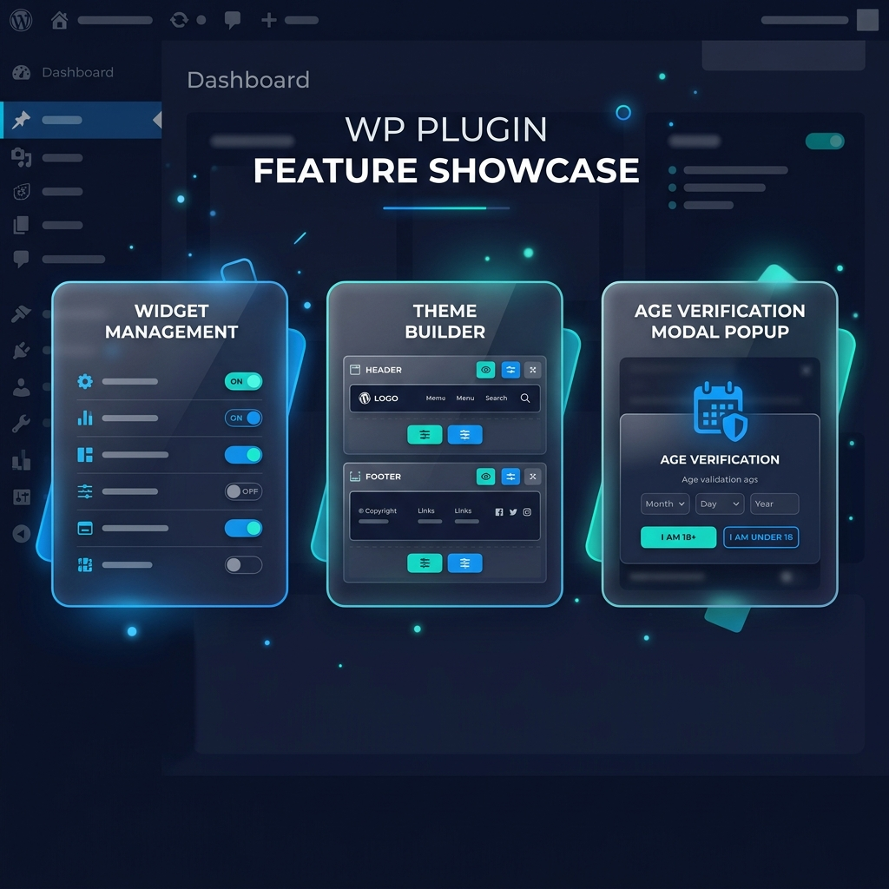
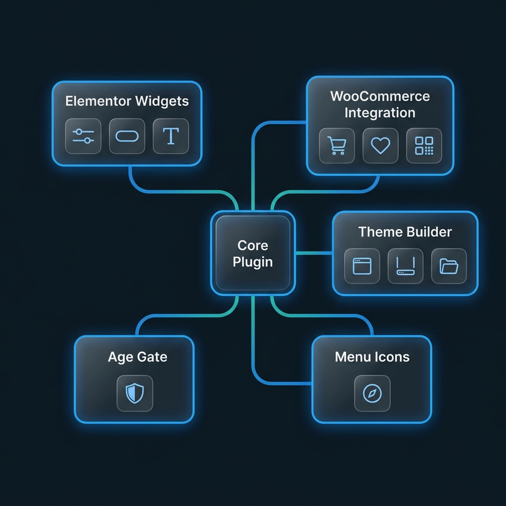

  

<h1 align="center">MH Plug — All-in-One Elementor Addon & WooCommerce Toolkit</h1>

  <strong>A premium WordPress plugin that supercharges Elementor with 30+ custom widgets, a visual Theme Builder, WooCommerce Wishlist system, Age Gate verification, and more.</strong>

  
  
  
  
  
  

---

  

---

## 📋 Table of Contents

- [Overview](#-overview)
- [Features at a Glance](#-features-at-a-glance)
- [Elementor Widgets](#-elementor-widgets-34-widgets)
- [Theme Builder](#-theme-builder)
- [WooCommerce Integration](#-woocommerce-integration)
- [Age Gate System](#-age-gate--age-verification)
- [Menu Icon Picker](#-menu-icon-picker)
- [Admin Dashboard](#-admin-dashboard)
- [Requirements](#-requirements)
- [Installation](#-installation)
- [FAQ](#-frequently-asked-questions)
- [Changelog](#-changelog)
- [Support](#-support)
- [Author](#-author)

---

## 🌟 Overview

**MH Plug** is a premium WordPress plugin built to extend **Elementor Page Builder** with a curated library of custom widgets, a fully functional **Theme Builder**, deep **WooCommerce** integration, a customizable **Age Gate** system, and a **Menu Icon Picker**. Every feature is toggleable from a centralized Neumorphic-styled admin dashboard — giving you complete control over what loads on your site.

### Why Choose MH Plug?

| Aspect | MH Plug Advantage |
|--------|-------------------|
| **⚡ Performance** | Smart conditional loading — only assets for active widgets are loaded |
| **🔧 Modularity** | Every widget and feature can be toggled on/off from the dashboard |
| **🛒 WooCommerce** | Deep integration with custom attributes, Quick View, and full Wishlist |
| **🎨 Design** | Premium Neumorphic admin UI with 3D toggle switches |
| **🏗️ Flexibility** | Full Theme Builder for Headers, Footers, Singles, Archives & Quick Views |
| **🔒 Security** | Nonce-verified AJAX, sanitized inputs, and capability checks everywhere |

  

---

## ⚡ Features at a Glance

| Feature | Description | Dependency |
|---------|-------------|------------|
| 🧩 **34 Elementor Widgets** | Full library of content, WooCommerce & layout widgets | Elementor |
| 🎨 **Theme Builder** | Visual template builder for Headers, Footers, Singles, Archives | Elementor |
| 🛒 **WooCommerce Wishlist** | Database-backed wishlist with AJAX toggle, for guests & users | WooCommerce |
| 👁️ **Quick View Popup** | AJAX-powered product quick view with Elementor template support | WooCommerce |
| 🔍 **Live Product Search** | Real-time AJAX product search with thumbnails and prices | WooCommerce |
| 🔞 **Age Gate Verification** | Global/per-page age verification with cookie persistence | None |
| 🎯 **Menu Icon Picker** | Add custom icons (MH Icons + Font Awesome 7) to nav menus | None |
| ⚙️ **Widget Manager** | Centralized dashboard to enable/disable every widget & feature | None |

---

## 🧩 Elementor Widgets (34 Widgets)

All widgets appear in the **"MH Plug"** category inside Elementor and feature an **"MH" badge** in the editor for easy identification.

### 📝 Content & Layout Widgets

| # | Widget | Description |
|---|--------|-------------|
| 1 | **Advanced Heading** | Rich heading with multiple styles, gradient text, and decorators |
| 2 | **Brush Text** | Artistic text with brush stroke effects and color filters |
| 3 | **Brush Slider** | Animated slider with brush stroke visual effects |
| 4 | **Button** | Customizable CTA button with hover animations |
| 5 | **Feature Card** | Icon/image cards with title, description & CTA |
| 6 | **Image Circle** | Circular image display with overlay effects |
| 7 | **Image Circle Slider** | Carousel of circular images with Slick integration |
| 8 | **Stacked Carousel** | 3D stacked card carousel effect |
| 9 | **Post Carousel** | Dynamic post slider with category filters |
| 10 | **Synced Slider** | Main + thumbnail synchronized slider |
| 11 | **Taxonomy Card** | Display categories/taxonomies as styled cards |

### 🔧 Site Builder Widgets

| # | Widget | Description |
|---|--------|-------------|
| 12 | **Site Logo** | Dynamic site logo from WordPress Customizer |
| 13 | **Site Title** | Dynamic site title with link and styling options |
| 14 | **Nav Menu** | Fully responsive navigation with hamburger menu & mobile drawer |
| 15 | **Copyright** | Dynamic copyright text with auto-updating year |

### 🛍️ WooCommerce Widgets (Requires WooCommerce)

| # | Widget | Description |
|---|--------|-------------|
| 16 | **Product Grid** | Filterable product grid with Quick View & Wishlist buttons |
| 17 | **Product Search** | Live AJAX search with instant product previews |
| 18 | **Product Title** | Dynamic single product title |
| 19 | **Product Price** | Dynamic product price with sale/regular formatting |
| 20 | **Product Gallery** | Product image gallery with thumbnail navigation |
| 21 | **Product Rating** | Star rating display with review count |
| 22 | **Product Short Description** | Product excerpt / short description |
| 23 | **Product Category** | Product category display with links |
| 24 | **Product Tags** | Product tags display with styling options |
| 25 | **Product Brands** | Product brand attribute display |
| 26 | **Product Breadcrumb** | WooCommerce breadcrumb navigation |
| 27 | **Product Share** | Social sharing buttons for products |
| 28 | **Product Data Accordion** | Product tabs (Description, Reviews, etc.) in accordion format |
| 29 | **Custom Add to Cart** | Neumorphic-styled add-to-cart with attribute selectors & quantity controls |
| 30 | **Product Attributes** | Product attributes table display |
| 31 | **Wishlist Button** | Heart toggle button for adding/removing products from wishlist |
| 32 | **Wishlist Table** | Full wishlist page table with product details & actions |
| 33 | **Header Cart** | Mini cart icon with live item count for site headers |
| 34 | **Header Wishlist** | Wishlist icon with live count badge for site headers |

---

## 🎨 Theme Builder

Build complete custom layouts for every part of your WordPress site — without touching a single line of code.

### Supported Template Types

| Type | Description | Dependency |
|------|-------------|------------|
| 🔲 **Header** | Custom site-wide header | Elementor |
| 🔳 **Footer** | Custom site-wide footer | Elementor |
| 📄 **Single Post** | Custom blog post layout | Elementor |
| 📚 **Archive** | Custom blog/category archive layout | Elementor |
| 🛍️ **Single Product** | Custom single product page | Elementor + WooCommerce |
| 🏪 **Product Archive** | Custom shop/category page | Elementor + WooCommerce |
| 👁️ **Quick View** | Custom quick view popup template | Elementor + WooCommerce |

### How to Use

1. Navigate to **WP Admin → MH Plug → Theme Builder**
2. Click **"Create Template"** to open the creation modal
3. Name your template and select a type (e.g. "Main Header")
4. Click **"Save & Edit"** — you'll be taken to the Elementor editor
5. Design your template using any MH Plug or WooCommerce widgets
6. **Activate** the template using the status toggle on the template card
7. Your template automatically overrides the corresponding area on the frontend

### Key Highlights

- ✅ Design everything visually inside Elementor
- ✅ One-click activate/deactivate per template
- ✅ WooCommerce product context fully supported in editor preview
- ✅ Tab-based filtering (All, Header, Footer, Single, Archive, etc.)
- ✅ Delete and manage templates directly from the dashboard

---

## 🛒 WooCommerce Integration

MH Plug provides deep WooCommerce integration that goes far beyond basic widgets.

### 🤍 Wishlist System

A full-featured, **database-backed** wishlist that works for both **logged-in users** and **guests**.

**Features:**
- ❤️ Neumorphic-styled heart button with pulse animation
- 🔄 AJAX-powered add/remove/toggle — zero page reloads
- 👥 Works for logged-in users **and** guests
- 🚫 Smart duplicate prevention
- 📊 Dedicated wishlist table widget for displaying saved items
- 🔔 Header icon widget with live item count badge
- 📱 Fully responsive on all devices

### 👁️ Quick View System

An AJAX-powered product quick view popup that keeps shoppers on the page.

**Features:**
- 🎬 Slide-up animated modal with smooth overlay
- 📋 Full product details: image, title, price, description, add-to-cart
- 🎨 Supports custom Elementor templates designed in Theme Builder
- 🔀 Custom attribute selection on simple products
- 🛒 AJAX add-to-cart directly from the popup — no page reload
- ➕➖ Custom quantity increment/decrement buttons
- 🔄 WooCommerce cart auto-refreshes after adding items

### 🔍 Live Product Search

Real-time AJAX-powered product search that wows your customers:
- ⚡ Instant results as the user types
- 🖼️ Product thumbnail, title, and price in results
- 🔗 Direct link to product page from results
- 👥 Works for all visitors — no login required

### 📦 Custom Product Attributes

Enhanced attribute support for **simple products** (not just variable products):
- 🛒 Selected attributes are saved to the cart
- 📝 Attributes display on Cart & Checkout pages
- 💾 Attributes are permanently saved to the order record
- 👀 Enhanced attribute visibility in admin order details

---

## 🔞 Age Gate — Age Verification

A fully customizable age verification modal that blocks site access until the visitor confirms their age.

### Settings Panel

Access via **WP Admin → MH Plug → Age Gate**

#### ⚙️ General Settings
| Setting | Description | Default |
|---------|-------------|---------|
| Enable Global | Turn age gate on/off for the entire site | Off |
| Minimum Age | Required age threshold | 18 |
| Cookie Duration | Days to remember verified users | 30 |

#### 📝 Content Settings
| Setting | Description |
|---------|-------------|
| Show Site Logo | Display your WordPress site logo in the modal |
| Modal Heading | Main title text (e.g. "Age Verification Required") |
| Disclaimer / Subheading | Supporting text below heading |
| "Yes" Button Text | Confirm button label — supports `[Age]` placeholder |
| "No" Button Text | Deny button label |
| Redirect URL | Where to send users who click "No" |

#### 🎨 Appearance Settings
| Setting | Description |
|---------|-------------|
| Overlay Background | Semi-transparent overlay color (supports RGBA) |
| Modal Background | Modal card background color |
| Modal Shadow | Toggle drop shadow on the modal |
| Title Color | Heading text color |
| Text Color | Body text color |
| "Yes" Button Colors | Background, hover, and text colors |
| "No" Button Colors | Background, hover, and text colors |

### Per-Page Override

Each page/post has a meta box allowing you to override the global setting:
- **Use Global Setting** — Follow the global toggle
- **Force Enable** — Always show the age gate on this page
- **Force Disable** — Never show the age gate on this page

---

## 🎯 Menu Icon Picker

Add beautiful icons to your WordPress navigation menus — supporting both **MH Custom Icons** and **Font Awesome 7**.

### Features

- 🖼️ **Icon Picker Modal** — Searchable grid of icons in a popup
- 📚 **Two Icon Libraries:**
  - **MH Icons** — Custom icon set bundled with the plugin
  - **Font Awesome 7** — Full Font Awesome 7.1.0 library with search
- 👁️ **Hide Label Option** — Show icon only (hides the navigation text)
- ♿ **Accessibility** — Screen-reader-only text preserved for assistive devices
- ❌ **One-click Remove** — Remove any icon with a single click

### How to Use

1. Enable **"Menu Icons"** in **MH Plug Settings → Global Settings**
2. Navigate to **Appearance → Menus**
3. Expand any menu item → click **"Select Icon"**
4. Browse or search through **MH Icons** or **Font Awesome 7** tabs
5. Click an icon to apply it
6. Optionally toggle **"Hide Navigation Label"** to show icon only
7. Save the menu — icons display immediately on the frontend

---

## ⚙️ Admin Dashboard

The MH Plug admin dashboard features a premium **Neumorphic design** with organized sections.

### Widget & Feature Manager

Access via **WP Admin → MH Plug**

The settings page has three collapsible accordion sections:

| Section | Contains |
|---------|----------|
| **🌐 Global Settings** | Menu Icons toggle and future global features |
| **🛒 WooCommerce Features** | All WooCommerce-related widgets and the wishlist system |
| **🧩 Elementor Widgets** | All content, layout, and site builder widgets |

**Key Behaviors:**
- Each widget/feature has a premium **3D toggle switch** (on/off)
- **"Enable All" / "Disable All"** buttons per section for bulk management
- Sections are automatically **disabled with a notice** if their dependency (Elementor/WooCommerce) is not active
- Disabled sections preserve existing settings — nothing gets lost
- Disabling unused widgets improves page load performance

### Theme Builder Dashboard

Access via **WP Admin → MH Plug → Theme Builder**

- 📂 **Tab filtering:** All, Header, Footer, Single Post, Archive, Product Archive, Single Product, Quick View
- 🃏 **Template cards** with type badge, icon, active status toggle, edit link, and delete button
- ➕ **Create modal** with template name and type selector
- 🔒 WooCommerce template types are disabled when WooCommerce is not active
- ⚡ All operations (create, toggle, delete) happen via AJAX — no page reloads

---

## 📦 Requirements

| Requirement | Minimum Version | Notes |
|-------------|----------------|-------|
| WordPress | 5.0+ | Required |
| PHP | 7.4+ | Required |
| Elementor (Free or Pro) | 3.0+ | Required for widgets & Theme Builder |
| WooCommerce | 5.0+ | Optional — required for WooCommerce features only |

---

## 🚀 Installation

### Method 1: WordPress Upload

1. Download the plugin `.zip` file
2. Navigate to **WP Admin → Plugins → Add New → Upload Plugin**
3. Upload the `.zip` file and click **Install Now**
4. Click **Activate**

### Method 2: FTP / File Manager

1. Extract the `.zip` file
2. Upload the plugin folder to `/wp-content/plugins/`
3. Go to **WP Admin → Plugins** and activate **MH Plug**

### Getting Started

After activation:

1. 🏠 Go to **WP Admin → MH Plug** to open the Widget Manager
2. ✅ Enable/disable individual widgets and features as needed
3. 🎨 Visit **MH Plug → Theme Builder** to create custom headers, footers & templates
4. 🔞 Visit **MH Plug → Age Gate** to configure age verification
5. 🎯 Enable **Menu Icons** to add icons to your navigation menus
6. 🧩 Open **Elementor** and look for widgets in the **"MH Plug"** category

---

## ❓ Frequently Asked Questions

<strong>Do I need Elementor to use this plugin?</strong>

 
Elementor is required for the <strong>widgets</strong> and <strong>Theme Builder</strong>. However, the <strong>Age Gate</strong>, <strong>Menu Icon Picker</strong>, and <strong>WooCommerce Wishlist</strong> features work independently without Elementor.

<strong>Do I need WooCommerce?</strong>

 
WooCommerce is only required for the WooCommerce-specific widgets (Product Grid, Product Search, etc.), the Wishlist system, and Quick View. All other features work without WooCommerce.

<strong>Will disabling a widget affect my existing pages?</strong>

 
Disabling a widget prevents it from loading, which means pages using that widget will show a placeholder. Re-enabling the widget restores full functionality instantly — your designs are never lost.

<strong>Does the wishlist work for non-logged-in users?</strong>

 
Yes! Guest users are supported with session-based identification. Their wishlist persists as long as their browser session is active.

<strong>Can I customize the Quick View popup layout?</strong>

 
Yes! Create a "Quick View" template in the Theme Builder and design it using Elementor. The plugin will automatically use your custom template instead of the default layout.

<strong>How does the Age Gate cookie work?</strong>

 
When a visitor confirms their age, a secure browser cookie is set for the configured number of days. The age gate won't appear again until the cookie expires.

<strong>Is MH Plug compatible with any WordPress theme?</strong>

 
Yes! MH Plug works with any WordPress theme that supports Elementor. The Theme Builder feature can override headers, footers, and single/archive templates regardless of your active theme.

<strong>Does the plugin slow down my site?</strong>

 
No. MH Plug uses <strong>conditional asset loading</strong> — only CSS and JavaScript for widgets/features you have enabled are loaded. Disabled widgets consume zero frontend resources.

---

## 📝 Changelog

### Version 1.0.0 — Initial Release
- ✅ 34 Elementor widgets (17 general + 17 WooCommerce)
- ✅ Theme Builder with 7 template types (Header, Footer, Single, Archive, Product Single, Product Archive, Quick View)
- ✅ WooCommerce Wishlist system with database storage
- ✅ Quick View popup with Elementor template support
- ✅ Live product search with instant results
- ✅ Custom product attributes for simple products
- ✅ Age Gate with full appearance customization & per-page overrides
- ✅ Menu Icon Picker with MH Icons + Font Awesome 7
- ✅ Premium Neumorphic admin dashboard with 3D toggle switches
- ✅ Conditional asset loading for optimal performance
- ✅ Full security: nonce verification, capability checks, input sanitization

---

## 💬 Support

For support, feature requests, or bug reports:

- 📧 Email: [support@mhutin.com](mailto:support@mhutin.com)
- 🌐 Website: [mhutin.com](https://mhutin.com/)

---

## 👨‍💻 Author

  <strong>Developed by MHutin</strong> 
  <a href="https://mhutin.com/">mhutin.com</a>

---

  © 2026 MHutin. All rights reserved. 
  MH Plug is a premium product. Unauthorized redistribution is prohibited.

